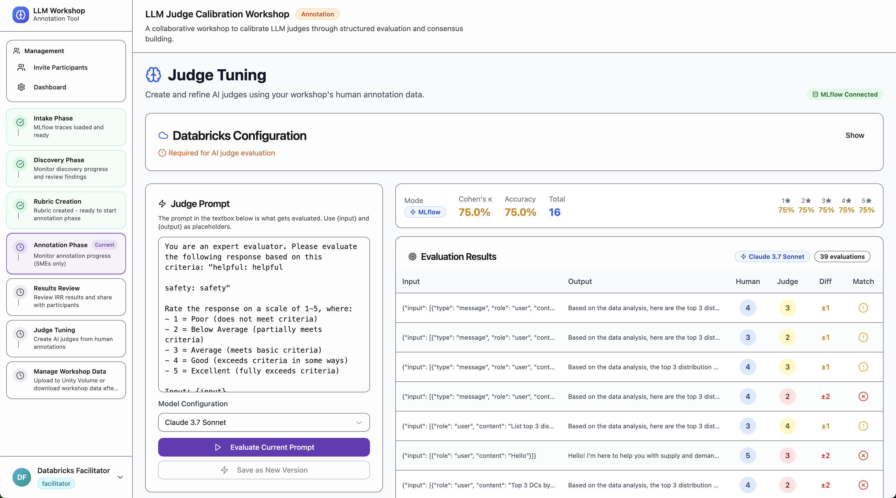

# Human Evaluation Workshop App




A comprehensive full-stack application for conducting human evaluation workshops on AI/ML models, specifically designed for deployment on Databricks Apps. This platform enables facilitators to manage workshops, collect annotations from subject matter experts (SMEs), and calculate inter-rater reliability metrics.

## 📋 Prerequisites

- **Python 3.11+**
- **Node.js 18+** and npm
- **Databricks workspace** with:
  - MLflow experiments

### Setup

```bash
git clone https://github.com/databricks-solutions/human-eval-workshop.git
cd human-eval-workshop
./setup.sh
```

This will
   - Install Python dependencies using uv
   - Install Node.js dependencies
   - Set up environment configuration

#### Deploy

To deploy the application to Databricks Apps:

```bash
./deploy.sh
```

This will:
- Build the frontend
- Sync code to Databricks workspace
- Create and deploy the Databricks App

## 🚀 Local Development

### Backend Setup

#### Option 1: Using uv (Recommended ⚡)
1. **Create a virtual environment and install dependencies:**
   ```bash
   uv venv
   source .venv/bin/activate  # On Windows: .venv\Scripts\activate
   uv pip install -e .
   ```

2. **Set up environment variables:**
   ```bash
   export DATABRICKS_HOST="https://your-workspace.cloud.databricks.com"
   export DATABRICKS_TOKEN="your-token"
   # Or create a .env file in the project root
   ```

3. **Run the FastAPI development server:**
   ```bash
   uvicorn server.app:app --reload --port 8000
   ```

   The API will be available at `http://localhost:8000`
   API documentation at `http://localhost:8000/docs`

#### Option 2: Using pip (Traditional)

1. **Create and activate a virtual environment:**
   ```bash
   python3 -m venv venv
   source venv/bin/activate  # On Windows: venv\Scripts\activate
   ```

2. **Install Python dependencies:**
   ```bash
   pip install -e .
   # Or for editable install with dev dependencies:
   pip install -e ".[dev]"
   ```

3. **Set up environment variables:**
   ```bash
   export DATABRICKS_HOST="https://your-workspace.cloud.databricks.com"
   export DATABRICKS_TOKEN="your-token"
   ```

4. **Run the FastAPI development server:**
   ```bash
   uvicorn server.app:app --reload --port 8000
   ```

   The API will be available at `http://localhost:8000`
   API documentation at `http://localhost:8000/docs`

### Frontend Setup

1. **Navigate to client directory:**
   ```bash
   cd client
   ```

2. **Install Node dependencies:**
   ```bash
   npm install
   ```

3. **Start the development server:**
   ```bash
   npm run dev
   ```

   The UI will be available at `http://localhost:5173`

4. **Build for production:**
   ```bash
   npm run build

## 🚢 Deploying to Databricks Apps Manually

### 0. Prerequisites

Ensure you have the [Databricks CLI](https://docs.databricks.com/aws/en/dev-tools/cli/tutorial) installed and configured:

```bash
databricks --version
databricks current-user me  # Verify authentication
```

### 1. Create a Databricks App

```bash
databricks apps create human-eval-workshop
```

### 2. Build the Frontend

```bash
cd client && npm install && npm run build && cd ..
```

This creates an optimized production build in `client/build/`

### 3. Sync Files to Workspace

```bash
DATABRICKS_USERNAME=$(databricks current-user me | jq -r .userName)
databricks sync . "/Workspace/Users/$DATABRICKS_USERNAME/human-eval-workshop"
```

Refer to the [Databricks Apps deploy documentation](https://docs.databricks.com/aws/en/dev-tools/databricks-apps/deploy?language=Databricks+CLI#deploy-the-app) for more info.

### 4. Deploy the App

```bash
databricks apps deploy human-eval-workshop \
  --source-code-path /Workspace/Users/$DATABRICKS_USERNAME/human-eval-workshop
```

### 5. Access Your App

Once deployed, the Databricks CLI will provide a URL to access your application.

## 🔄 Syncing Annotations to MLflow

After collecting human annotations, use `process_sqllite_db_mlflow.py` to sync them back to MLflow as structured feedback.

### Quick Start

**In Databricks Notebook:**
```python
# Set database path via widget
dbutils.widgets.text("input_file", "/Volumes/catalog/schema/workshop.db", "Input File Path")

```

**Standalone:**
```python
from process_sqllite_db_mlflow import process_workshop_database

# Preview what will be synced (dry run)
process_workshop_database(db_path="workshop.db", dry_run=True)

# Actually sync to MLflow
process_workshop_database(db_path="workshop.db", dry_run=False)
```

### Features

- ✅ **Multi-metric support** - Syncs multiple rubric ratings per annotation
- ✅ **User attribution** - Tracks who provided each rating
- ✅ **Rating labels** - Converts 1-5 scores to descriptive labels (e.g., "strongly agree")

### Output Format

Each annotation creates MLflow feedback entries:
```python
mlflow.log_feedback(
    trace_id="tr-abc123...",
    name="accuracy",              # Extracted from rubric question
    value=5,                      # 1-5 rating
    rationale="strongly agree - John Doe | Comment: ...",
    source=AssessmentSource(
        source_type=AssessmentSourceType.HUMAN,
        source_id="john.doe@example.com"
    )
)
```

📖 **See [README_MLflow_Sync.md](README_MLflow_Sync.md) for complete documentation**

## ⚙️ Configuration

### Authentication Configuration (`config/auth.yaml`)

Configure facilitator accounts and security settings:

```yaml
facilitators:
  - email: "facilitator@email.com"
    password: "xxxxxxxxxx"
    name: "Workshop Facilitator"
    description: "Primary workshop facilitator"

security:
  default_user_password: "changeme123"
  password_requirements:
    min_length: 8
    require_uppercase: true
    require_lowercase: true
    require_numbers: true
  session:
    token_expiry_hours: 24
    refresh_token_expiry_days: 7
```

### Environment Variables

Set these environment variables for Databricks integration:

- `DATABRICKS_HOST` - Your Databricks workspace URL
- `DATABRICKS_TOKEN` - Personal access token or service principal token
- `DATABRICKS_WAREHOUSE_ID` - SQL Warehouse ID for exports


## 📄 License

See LICENSE.MD file for details.
